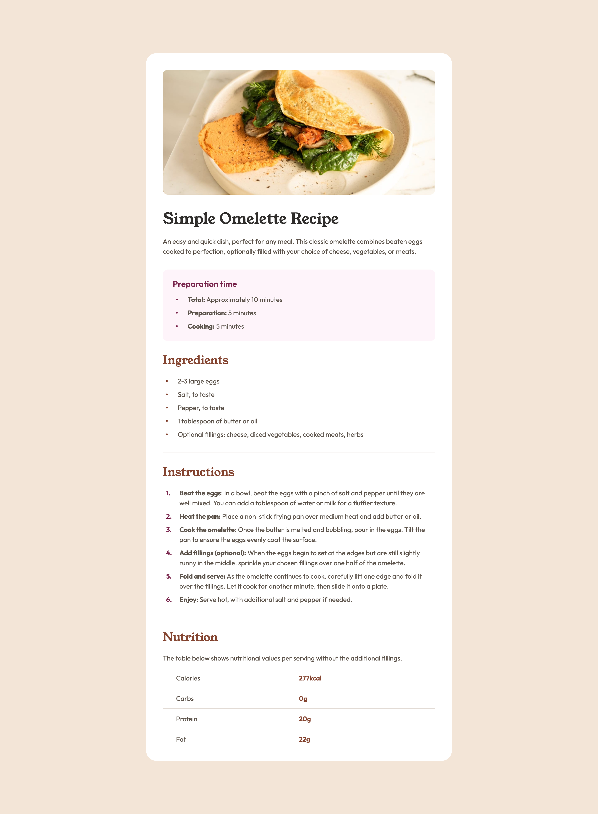

# Frontend Mentor - Recipe page solution

This is a solution to the [Recipe page challenge on Frontend Mentor](https://www.frontendmentor.io/challenges/recipe-page-KiTsR8QQKm). The project is a static, responsive recipe page implemented with semantic HTML and CSS following a mobile-first approach.

## Table of contents

- [Overview](#overview)
- [The challenge](#the-challenge)
- [Screenshot](#screenshot)
- [Links](#links)
- [My process](#my-process)
  - [Built with](#built-with)
  - [What I learned](#what-i-learned)
  - [Continued development](#continued-development)
  - [Useful resources](#useful-resources)
- [Author](#author)

## Overview

A simple, clean recipe page that displays a hero image, a recipe header with title and description, preparation times, an ingredients list, step-by-step instructions, and a small nutrition table. The layout is responsive and uses local fonts and CSS custom properties for consistent styling.

### The challenge

The goal from the Frontend Mentor challenge is to build a responsive recipe page that matches the given design and works across common viewport sizes. The main acceptance criteria are semantic markup, responsive layout, correct typography, and visual accuracy.

### Screenshot

### Links

- Solution URL: [https://github.com/jorgeLRM/recipe-page](https://github.com/jorgeLRM/recipe-page)
- Live Site URL: (add your live site link if deployed, e.g., GitHub Pages)

## My process

### Built with

- Semantic HTML5
- CSS custom properties
- Flexbox and CSS Grid for layout
- Mobile-first workflow with breakpoints at 768px and 1440px
- Locally hosted fonts via `@font-face` (`Outfit`, `YoungSerif`)

### What I learned

- How to structure a content-first HTML layout using `main`, `article`, `section`, and `header`.
- Applying mobile-first responsive styles and upgrading the layout at the 768px and 1440px breakpoints.
- Managing typography with locally hosted variable fonts and `font-display` for better experience.
- Styling list components and small UI pieces (decorative bullets with ::before, numbered instruction styles).

### Continued development

- Improve accessibility: add focus styles, keyboard support, and better ARIA attributes where needed.
- Optimize images with `srcset` and `sizes` for responsive loading and performance.
- Add simple performance/accessibility checks (Lighthouse, axe) and fix findings.

### Useful resources

- Frontend Mentor challenge page — design reference and acceptance criteria.
- MDN web docs — for `@font-face`, responsive images, and accessibility guidance.

## Author

- Frontend Mentor - [@jorgeLRM](https://www.frontendmentor.io/profile/jorgeLRM)
- Twitter - [@JorgeLrm99](https://x.com/JorgeLrm99)
